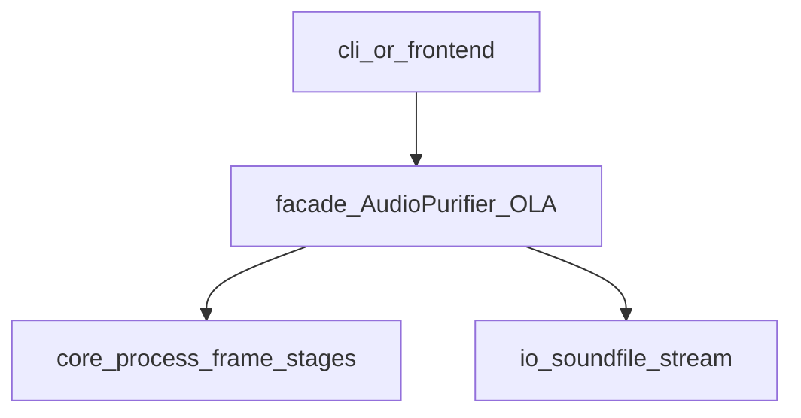

# Phase0、分支策略与 main↔tutorial 对照

本文是原 `docs/phase0/` 下多篇材料的**合并版**（索引、对比快照、范围、架构方向、接口门禁、倒推映射），作为 **Phase0 与分支说明的单一入口**。数学与产品细节仍以 [`prd.md`](prd.md)、[`software_design.md`](software_design.md) 等为准；**工程实现以 `tutorial` 分支源码为准**。

## 前言：谁该读本文

- 需要理解 **`main`（Phase0 骨架）** 与 **`tutorial`（可交付实现）** 为何拆分、如何切换分支。
- 需要 **可复现的 Git 对照**（commit、行数、目录增量）以做评审或倒推验收。
- 需要从 Phase0 条目 **跳到 `tutorial` 中的文件路径** 做代码走读。

阅读顺序建议：先读本节与「撰写原因」→「Git 元信息与量级」→ 按需跳至「范围」「架构」「接口」或「路径映射表」。

## 撰写原因（为何需要集中成一篇）

- **可追溯**：评审与协作者不必自行执行 `git diff`；差异有单一入口说明，并可对照固定 commit。
- **防误解**：`main` 与 `tutorial` **不是**两套无关仓库，而是**同一历史线上的前后状态**（`tutorial` 在共同祖先之上追加提交）。
- **支撑倒推**：Phase0 规划应能从可交付实现归纳；本指南提供**可枚举、可核对**的分支差异与路径映射。
- **协作与 onboarding**：先读本文再读仓库根目录 [`README.md`](../README.md)，理解「骨架分支 vs 可交付分支」成本最低。

## Git 元信息（可复现）

| 项目 | 值 |
|------|-----|
| 快照日期 | 2026-04-19 |
| `git merge-base main tutorial` | `db2cc151eb2d995c1a5bf057bae1ff2799f1c5f3`（与将 `main` 替换为 Phase0 骨架**之前**的 `main` 顶端一致） |
| 对比中的 `main`（旧顶端） | `db2cc151eb2d995c1a5bf057bae1ff2799f1c5f3` |
| `tutorial` 顶端（快照时） | `ff9f489a2634adf743f27db95c06cda2d2d5411d` |

**复现命令**（只读）：

```bash
git merge-base main tutorial
git diff --shortstat main...tutorial
git diff --stat main...tutorial
git log --oneline main..tutorial
```

## 量级摘要（`tutorial` 相对上述旧 `main`）

- **82 files changed**, **6004 insertions(+), 373 deletions(-)**（`git diff --shortstat main...tutorial`）。

若当前检出的是 **已替换为 Phase0 骨架之后的 `main`**，则与 `tutorial` 的差异会**大于**上表；上表锚定 **旧 `main`（`db2cc15`）↔ `tutorial`（`ff9f489`）**，用于说明可交付增量从何而来。

## 分类对照（目录与职责）

下列依据 `git diff --stat main...tutorial` 与 `git ls-tree` 归纳；**不**评价设计优劣，仅陈述增量。

| 区域 | 旧 `main` | `tutorial` 增量要点 |
|------|-----------|---------------------|
| 顶层 | 无 `frontend/`、`.streamlit/`、`scripts/`、`tutorial/` | **Streamlit 前端**、**脚本**（基准与辅助）、**教程 Markdown** |
| `src/core/` | 含早期形态 | **`process_frame` 单帧链**、`core/pipeline/` 兼容 re-export、`array_types`、`grouping`（W-correlation）等 |
| `src/facade/` | 较简 `purifier` | **OLA 引擎**、PCM 生产者、扩展门面与错误路径 |
| `src/io/` | 较简 | **格式白名单**、立体声读写、`io_messages`、能力探测 |
| `tests/` | 少量 | **大量回归与冒烟**（CLI、purifier 流、对角、SVD 等） |
| CI / 工具 | 较旧 `actions` | 较新 checkout/setup、`pyproject.toml` 中 pytest 覆盖率等 |

## 范围与非目标（Phase0 规划边界）

从 **`tutorial` 已具备的能力**倒推：Phase0 规划应锁定的边界如下。

### 目标（与可交付方向一致）

- **立体声 PCM 降噪**：MSSA 数值链，保持左右声道相位关系（与 PRD 一致）。
- **工程约束**：流式/分帧大文件；类型注解与静态检查；测试驱动关键数值与 I/O 契约。
- **用户入口**：命令行与（规划上可选）本地控制平面；敏感信息不入库。

### 非目标

- **不在 Phase0 骨架分支追求与 `tutorial` 功能对等**：当前 **`main`** 上占位 CLI **不**实现 Hankel/SVD/OLA；完整实现见 **`tutorial`**。
- **前端**：Streamlit 等为 **可选**；核心验收以 CLI/库与测试为准（PRD F-05）。
- **实时低延迟**：以离线/准离线批处理为主，除非单独立项。

### 与 `tutorial` 的快速对照

| 主题 | `tutorial` 中可核对的落点（示例） |
|------|-------------------------------------|
| 单帧 MSSA 链 | `src/core/process_frame.py` 与 `stages/a_*`…`d_*` |
| 门面与 OLA | `src/facade/purifier.py`、`soundfile_ola.py` |
| I/O 与白名单 | `src/io/audio_formats.py`、`stereo_soundfile.py` |
| 教程与验收表 | `tutorial/TUTORIAL_INDEX.md` |

## 架构方向（规划版）

只锁 **分层与数据流**，不复制实现细节。细节以 **`tutorial`** 与 [`software_design.md`](software_design.md) 为准。

### 原则

- **单帧数值链显式、可测试**：Hankel 嵌入 → 多通道联合 → SVD 截断 → 对角重构；**不**采用泛型 `MSSAStage` + 动态 `Pipeline.execute` 调度（见软件设计规约当前版）。
- **门面薄**：构造参数校验、组合 I/O 与帧循环；重算法留在 `core/stages`。
- **异常不吞**：门面包装时 `raise … from exc` 保留链；可机读字段便于 CLI 退出码策略。

### 逻辑分层（目标形态）



**`main` 的 Phase0 骨架**仅保留占位入口以跑通 CI，不实现各层逻辑。

## 接口与质量门禁

### 对外接口（目标）

- **CLI**：`python -m src.cli …`（完整参数集在 **`tutorial`** 的 `src/cli.py`）。
- **库**：门面构造 + `process_file` 等（见 **`tutorial`** 的 `src/facade/purifier.py`）。
- **环境**：`PYTHONPATH=src` 与 `requirements*.txt`、根目录 README 一致。

当前在 **`main`** 上：`src.cli` 可仅作占位说明并指向 **`tutorial`**，用于证明包布局与 CI。

### 质量门禁

与 [`pyproject.toml`](../pyproject.toml)、[`.github/workflows/ci.yml`](../.github/workflows/ci.yml) 对齐：

| 工具 | 作用 |
|------|------|
| Ruff | 风格与常见错误 |
| Mypy（`strict`） | 静态类型 |
| Pytest + coverage | 测试与覆盖率（门槛见 `pyproject`） |

## 倒推附录：Phase0 条目 → `tutorial` 路径

评审溯源用：**左侧**为规划条目，**右侧**为在 **`tutorial`** 上可打开的路径（不粘贴代码正文）。

| Phase0 条目 | `tutorial` 上建议打开的位置 |
|-------------|---------------------------|
| 单帧 MSSA 顺序 | `src/core/process_frame.py`；`src/core/stages/a_hankel.py` → `b_multichannel.py` → `c_svd.py` → `d_diagonal.py` |
| 截断策略（固定秩 / 能量） | `src/core/strategies/truncation.py`；`make_svd_step` 在 `c_svd.py` |
| W-correlation（可选） | `src/core/strategies/grouping.py`；`c_svd.py` 中阈值路径 |
| 门面与 OLA | `src/facade/purifier.py`；`soundfile_ola.py`；`ola.py`；`pcm_producer.py` |
| CLI 与退出码 | `src/cli.py` |
| I/O 与格式白名单 | `src/io/audio_formats.py`；`audio_stream.py`；`stereo_soundfile.py` |
| 异常模型 | `src/core/exceptions.py`；`linalg_errors.py` |
| 回归与冒烟测试 | `tests/`（如 `test_process_frame.py`、`test_purifier_stream.py`、`test_c_svd.py`） |
| 可选前端 | `frontend/app.py`；`requirements-frontend.txt` |
| 脚本与基准 | `scripts/benchmark_pipeline.py` 等 |
| 教程与验收表 | `tutorial/TUTORIAL_INDEX.md` 及各章 `.md` |

**分工说明**：本节是「需求/条目 → 模块路径」映射；上文「Git 元信息与分类对照」是分支级事实与行数增量。二者互补。
