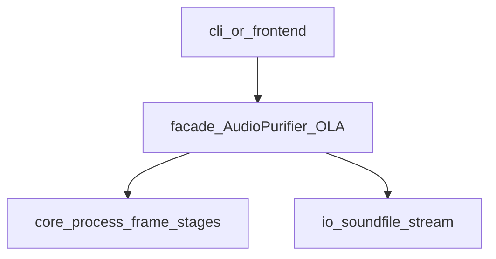

# Phase0 架构方向（规划版）

本节只锁 **分层与数据流**，不复制 `tutorial` 中的实现细节。细节以 `tutorial` 源码与 [`../software_design.md`](../software_design.md)（完整产品视角）为准。

## 原则

- **单帧数值链显式、可测试**：Hankel 嵌入 → 多通道联合 → SVD 截断 → 对角重构；避免仅为「模式」增加泛型 Pipeline 调度层（与现有设计说明一致）。
- **门面薄**：构造参数校验、组合 I/O 与帧循环；重算法留在 `core/stages`。
- **异常不吞**：映射为带 `__cause__` 的门面异常或记录完整栈；可机读字段便于 CLI 退出码策略。

## 逻辑分层（目标形态）

## 与 `tutorial` 的关系

上述各层在 **`tutorial` 分支**均有对应目录；本仓库 **`main` 的 Phase0 骨架**仅保留占位入口以跑通 CI，不实现各层逻辑。对照表见 [`04_reverse_from_tutorial.md`](04_reverse_from_tutorial.md)。
