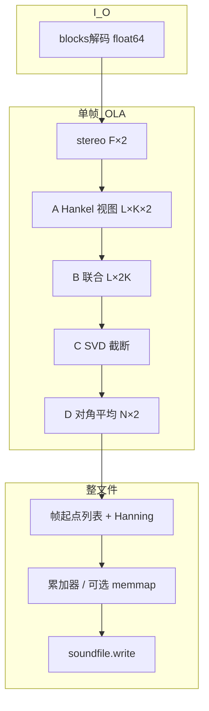

# 第 0 章：架构总览（一页纸）

## 核心链路：采样如何被「变形」

**一句话**：磁盘上是流；进入算子前被切成 **OLA 帧**；每帧在核心四层里走 **波形 → Hankel 视图 → 联合块 → 低秩块 → 对角平均回波形**；多帧重叠相加后写回文件。

### 最小符号表（抄笔记）

| 符号 | 含义 |
|------|------|
| \(F\) | 单帧样本数（每声道 \(F\) 点） |
| \(L\) | Hankel 窗口长（行数） |
| \(K\) | \(K=F-L+1\)（单声道 Hankel 列数） |
| 联合块 | 形状 **\(L\times 2K\)**（左右各 \(K\) 列） |
| D 输出长度 | 单声道对角平均序列长 **\(L+K-1\)**；立体声为 `(N,2)`，其中 \(N=L+K-1\)，详见 [04](04_对角平均与重构.md) |

### Pipeline 与 `execute` 类型（链上刻意不一致）

单帧入口为 **`FloatArray` 形状 `(F,2)`**。链内：`AHankelStage` 输出 **`tuple`**（左右各一块）；`BMultichannelStage` 起为二维 **`FloatArray`** 联合块；`CSVDStage` / `DDiagonalStage` 延续矩阵与重构帧类型。泛型见 [`src/core/pipeline.py`](../src/core/pipeline.py) 中 `MSSAStage` 与第 [01](01_从波形到矩阵.md)、[02](02_立体声联合块.md) 章代码锚点。

### 与课程学习目标的对照

三轨学习目标（数学 | 代码 | 工程）的完整可验收表述在 **[`TUTORIAL_INDEX.md`](TUTORIAL_INDEX.md)「课程学习目标」**；本章只给符号与类型速查，避免两处长篇重复。

## 工程亮点（工业级痕迹）

| 机制 | 位置（示意） | 目的 |
|------|----------------|------|
| Hankel 零拷贝 | `a_hankel.py` `as_strided` | 避免 Python 嵌套循环填矩阵 |
| 联合块连续内存 | `b_multichannel.py` `ascontiguousarray` | 喂 LAPACK/BLAS |
| 截断 SVD / 全谱 | `c_svd.py` `svds` vs `linalg.svd` | 固定秩省算力；能量模式需全谱 |
| W-corr 首帧冻结（能量） | `c_svd.py` `_energy_w_corr_frozen` | 避免每帧 k 变就重算整张 W |
| 对角平均省索引板 | `d_diagonal.py` 按 `t=i+j` 聚合 | 降峰值 RSS |
| 有界队列 + 毒丸 | `pcm_producer.py` | 背压与优雅退出 |
| 路径/后缀白名单 | `audio_formats.py` | 防御性 I/O |
| 分层异常 | `exceptions.py` + facade | 可分类处理与 CLI 退出码 |

## 知识挂钩速查

| 现象 | 线性代数 | 软件工程 |
|------|----------|----------|
| Hankel 块 | 滞后嵌入、秩与轨迹矩阵 | 视图与所有权 |
| 联合块 SVD | 主子空间、奇异值能量 | 策略模式、固定秩 vs 能量 |
| 对角平均 | 逆嵌入、一般非 Hankel | 算法闭环与近似 |
| OLA | 短时平稳假设 | 分帧、窗、重叠 |

## 与分章关系

- **01～04**：对应单帧内 A→B→C→D 的数学与实现。  
- **05**：帧与整文件、流与 memmap。  
- **06**：异常、测试与边界。

读完本章再进 **01**，路径最顺。
